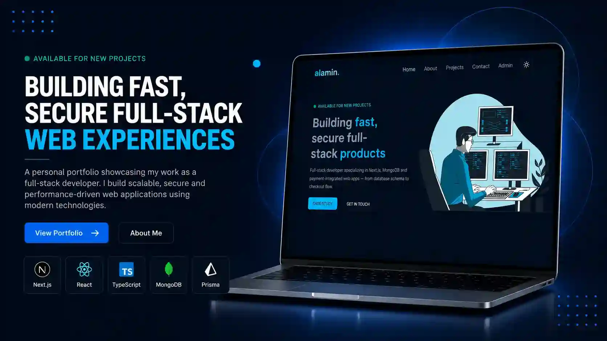

# Alamin Portfolio — Full-Stack Developer Portfolio & Case Study CMS

A modern, full-stack developer portfolio built with **Next.js App Router**,
**Prisma**, **NextAuth**, and **Cloudinary**. It features a public-facing
portfolio site along with a fully custom **Admin Dashboard** to manage project
case studies — from writing and publishing to editing and deleting, all without
touching code.


---

## Live Demo

**Live Preview:** (https://example.com/)

---

## ✨ Features

### Public Portfolio

- Hero Section with Availability Status
- About Me Section
- Skills & Tools Showcase
- Case Studies / Projects Listing
- Single Case Study Detail Page
- Contact Form with Email Notifications
- Dark & Light Mode Toggle
- Custom Animated Cursor
- Fully Responsive Design

### Admin Dashboard

- Secure Admin Login
- Dashboard Overview (Total Case Studies, Published Count, Latest Project, Total
  Views)
- Add Case Study
- Edit Case Study
- Delete Case Study
- View Single Case Study
- All Case Studies List View
- Profile Management
- Account Settings

### Authentication

- Admin Login (NextAuth + bcrypt)
- Email Verification
- Protected Routes via Middleware

### Other Features

- Image Upload with Cloudinary
- Server Actions (no separate REST layer needed)
- Form Validation with React Hook Form + Zod
- Toast / SweetAlert2 Notifications
- Loading States & Error Handling

---

## Tech Stack

| Frontend                | Backend & Services     |
| ----------------------- | ---------------------- |
| Next.js 16 (App Router) | Next.js Server Actions |
| React 19                | Prisma ORM             |
| TypeScript              | NextAuth               |
| Tailwind CSS 4          | bcrypt                 |
| next-themes (Dark Mode) | Cloudinary             |
| Lucide React (Icons)    | Nodemailer             |
| React Hook Form         | Middleware             |
| Zod                     | Slugify                |
| SweetAlert2             | clsx                   |

---

## Screenshots



---

## Project Structure

```text
src/
├── actions/
│   ├── authActions.ts
│   ├── profileActions.ts
│   ├── projectActions.ts
│   └── sendEmailAction.ts
│
├── app/
│   ├── (admin)/
│   │   ├── admin/
│   │   └── layout.tsx
│   │
│   ├── (auth)/
│   │   ├── login-admin/
│   │   └── verification/
│   │
│   ├── (client)/
│   │   ├── projects/
│   │   ├── layout.tsx
│   │   └── page.tsx
│   │
│   ├── api/
│   ├── favicon.ico
│   ├── globals.css
│   └── layout.tsx
│
├── components/
│   ├── admin/
│   ├── auth/
│   ├── home/
│   ├── layout/
│   └── ui/
│
├── libs/
├── provider/
└── middleware.ts
```

---

## Getting Started

### Clone the Repository

```bash
git clone https://github.com/alamin-one/my-portfolio.git
```

### Navigate to the Project

```bash
cd my-portfolio
```

### Install Dependencies

```bash
npm install
```

### Run the Development Server

```bash
npm run dev
```

Open your browser and visit:

```
http://localhost:3000
```

---

## Environment Variables

Create a `.env` file in the project root.

```env
DATABASE_URL=

NEXTAUTH_SECRET=
NEXTAUTH_URL=http://localhost:3000

EMAIL_USER=
EMAIL_PASS=

CLOUDINARY_PRESET_NAME=
CLOUDINARY_CLOUD_NAME=
CLOUDINARY_API_KEY=
CLOUDINARY_API_SECRET=
```

---

## Repository

https://github.com/alamin-one/my-portfolio

---

## Developed By

**Al-Amin**

GitHub: https://github.com/alamin-one

---

## License

This project is licensed under the **MIT License**.

---

## Support

If you found this project helpful, consider giving it a ⭐ on GitHub.
